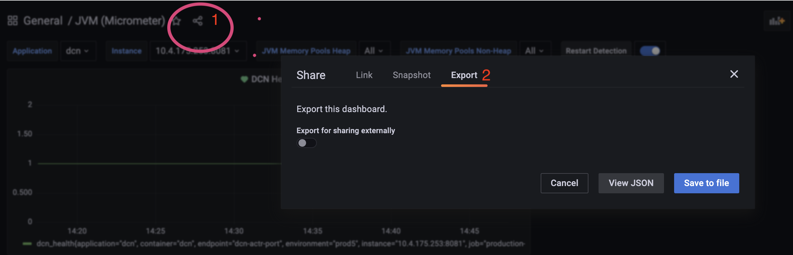

In dit folder vind je hoe kan je exports/import van Grafana en Kibana dashboarden.
links naar Grafana en Kibana kan je vinden in confluence 
[Link Text](https://SSSSSSSSSSSSSSSSSS/display/PLOOI/StandaardPlatform+-+DCN)

Kibana 

Export maken van een kibana:-
1- Ga naar de [Kibana 'Saved objects' page](https://SSSSSSSSSSSSSSSSSS/s/koop-plooi-prod/app/management/kibana/objects)
2- In save object page kan je het huidige dashboards exporteren en dashboards importeren.

Grafana
Op grafa zijn 3 dashboard gemaakt 
1- JVM dashboard voor het monintoring van de DCN applicatie 
2- Solr dashboard 
3- Postgres dashboard

Grafana Export
1- Export grafana dashboard bij klik op de share icon naast de dashboard title, Zie scherm 
2- Selecteer export en download het bestand.

Grafana import
1- Import in grafana kan via de home page, https://grafana.cicd.s15m.nl/grafana
2- Klik op + (plus) in de menu en daarna importeer het dashboard

